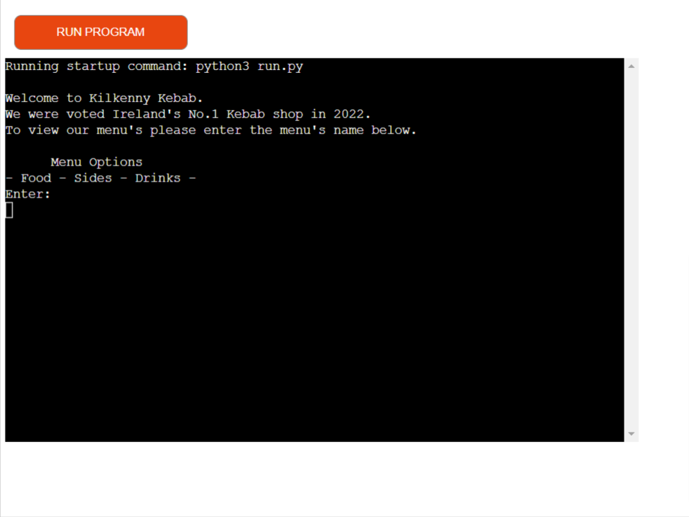

# Kilkenny Kebab

## Overview

Welcome to kilkenny Kebab. Kilkenny Kebab is a fictional kebab shop in Kilkenny city.
The idea for this project came from my love of kebabs and my overuse of the JustEat app.

This project was deployed using Heroku and is operated through the Code Institute mock terminal.
My Goal with this project was to keep the ordering process simple and to keep the user in a continuous loop.
The loop is only exited out of when the user completes their order. 
I wanted to keep the process as realistic as possible by adding estimated delivery times and delivery fee's etc.

[Kilkenny Kebab Live Website here](https://kilkennykebab.herokuapp.com/)

# Table of Contents

____

1. [Flow Chart](#flow-chart)
2. [Google Sheets](#google-sheets)
3. [User Experience](#user-experience)
    * [Welcome User & Menu Choice](#welcome-user-&-menu-choice)
    * [Select Items](#select-items)
    * [View Basket](#view-basket)
        1. [Add More Items](#add-more-items)
        2. [Remove Items](#remove-items)
        3. [Checkout](#checkout)
    * [Collection or Delivery](#collection-or-delivery)   
        1. [Delivery](#delivery)
        2. [Collection](#collection)
4. [Technologies](#technologies)
    * [PYTHON](#python)
    * [JAVASCRIPT](#javascript) 
    * [GOOGLE SHEETS](#google-sheets)  
    * [GOOGLE CLOUD](#google-cloud)
5. [Testing](#testing)
6. [Deployment](#deployment)
7. [Bugs](#bugs) 
8. [Further Features](#further-features)
9. [Credits](#credits)
10. [Acknowledgement](#acknowledgement)

---

# Flow Chart

This flow chart outlines my thought proccess and the pathway of the code.

---

# Google Sheets

These are the 4 Google sheets I created to help me display menu's and contain users order.

# User Experience 

The user experince was at the forefront of my planning and implimentation of my code. 
I executed this by making the ordering process simple and straightforward.

## Welcome User & Menu Choice

The first thing the user see's is a welcoming text and immeditately tells the users to enter the menu name they wish to view.

## Select Items 

After the user selects the menu they want to view, a list of menu items apear to the user. The user is then asked to enter a menu 
item numbers. If the user selects a valid item number they are informed this item in placed into their basket. The user is promted to enter
either the menu name of the menu they wish to order more items for or to view their current basket.

If the users input is invalid they are promted to enter a valid item number

## View Basket

If the user selects 'View', their basket is displayed on the terminal with corresponding item numbers.
The user is then given 3 options
    1. Add more items
    2. Remove items
    3. Checkout 

### Add More Items

Its as simple as it sounds. If the user selects 'Add' they are then brought back to the Menu Choice option.

### Remove Items

Again its simple. If the user selects 'Rem' The user is asked to enter the item number of the item they wish to remove from their basket. 
After removing the item The user is shown their new basket and the View Basket step is repeated.

### Checkout 

If the user is happy with their basket and they enter 'Out', they are then taken to the checkout menu.

## Collection Or Delivery

This first step of teh checkout process.

The user is asked wether they wish to collect their food or if they want the food delivered for an additional fee of €3.5.
The user must enter 'C' for collection or 'D' for delivery. 

### Delivery

If the user selects 'D', 2 possible outcomes can occur.

Outcome 1: If the users basket is over the value of €15 the user continues to the next step which involves them entering their EirCode.
           After the user confirms their EirCode they are then given an estimated time based off the time they placed their order.

Outcome 2: If the users basket is under the value of €15 the user is informed that Kilkenny Kebab don't do deliverys for under €15. 
           The user is then asked if they want to order more items to bring their basket value up, if the user enters 'O' They are 
           brought back to Menu Choice. Else if the user enter 'C' they get diverted to  food collection option.

### Collection 

If the user selects 'C'. They are informed of the approx time the food will be ready to be collected. 

---

# Technologies

### Python 

Program was fully coded using Python coding langugae.

    Python libraires.
    1. Gspread - Used to import the Gspread sheet
    2. Datetime - Used tp import current time.
    3. Google.oauth2.service_account - Used to import Credentials 

### JavaScript

Code Institute terminal was created with JavaScript.

### Google Sheets

Google sheets was used to store the menu items and the basket items.  

### Google Cloud

Google cloud was used to enable the APIs needed for this project.

--- 

# Testing 

Testing was conducted by me and several friends and family members. testing provided fruitfull as it outline issues with the project. 

# Deployment 

This app was deployed on Heroku. 

# Bugs 

There were several bugs that were identified during the development process. All bugs have been solved with fixes or work arounds using code.

-- Some bugs were --

Bug 1. If user entered number 8 or 0 for item number or basket number the program would close.

Fix 1. I used (IF OR) statements to keep asking the user what the item No. they want until they enter a valid item number. 

Bug 2. When the user wanted to add more items to the basket after viewing, new items would over-write current items in the basket   

fix 2. I created a function with columns and continuesly passed this function through relevant functions to maintain what column is currently in use.

Bug 3. The program would enter into the incorrect functions and remain in certain unwanted loops even when the user wished to finish their order. 

Fix 3. I re-wrote the menu function and to not recall functions, then I entered an exit function to automatically exit code when user finished order.

# Further Features 

I have 2 further features in mind that will be implemented in the future.

1. Add an alter section at the end before user checks out to allow user to alter their order, I.E No onions, gluten free etc..
2. Add discount options, I.E  if user adds certain cost price of food a discount will automatically apply. Along with mid week deals and weekend deals.   

# Code 

All the code was written by myself. 

The Time function was inpsired by https://www.programiz.com/python-programming/datetime/current-time

SCOPE inital constant variables were taken from Code institutes Love sandwhiches project.

# Credits

I give credits to 

1. William Nolan who is a software engineer who gave me adivce and helped test the code.

2. Jubril Akolade who is my Code Institute designated mentor. He gave me advice and guided me in the right direction. 